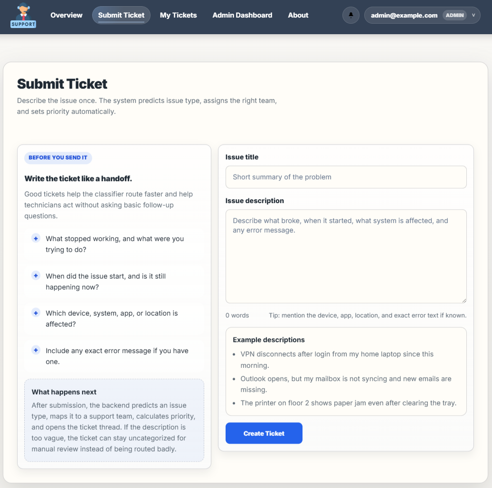
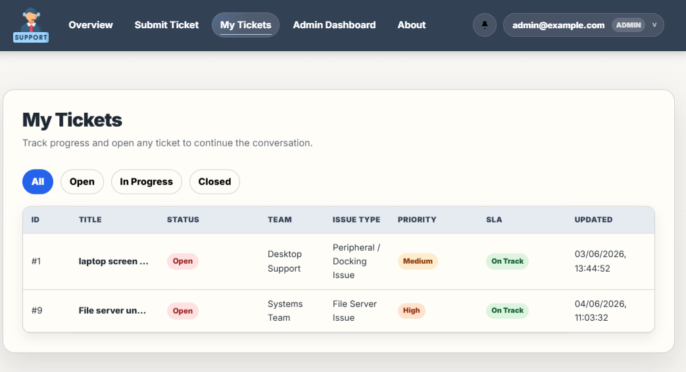
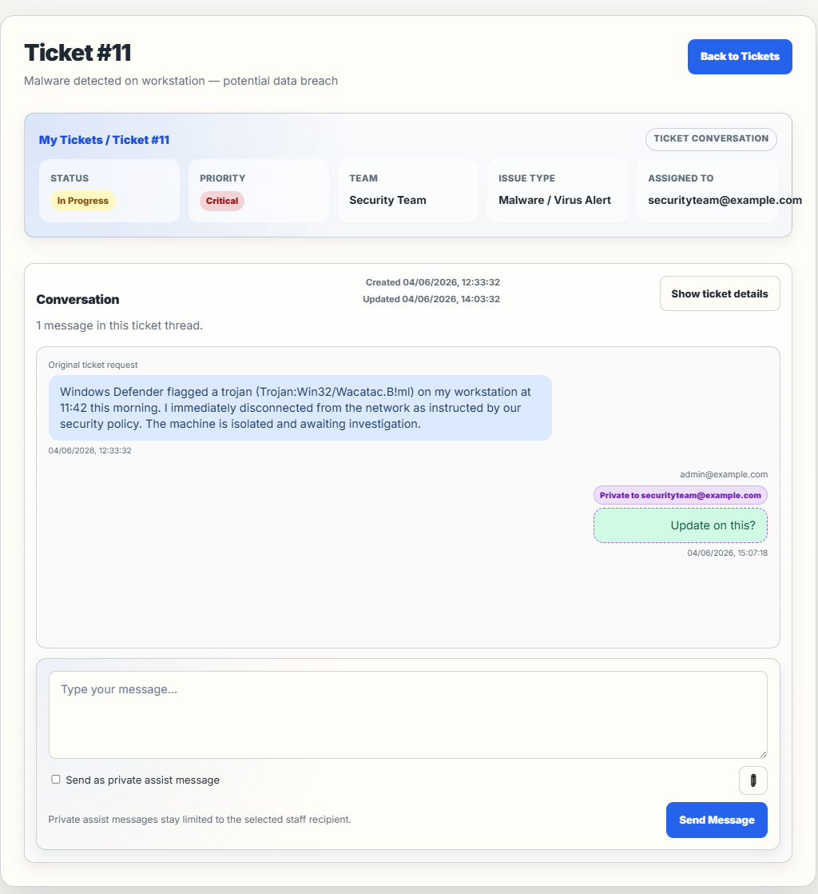
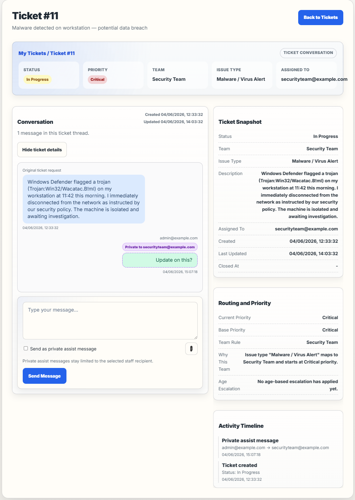
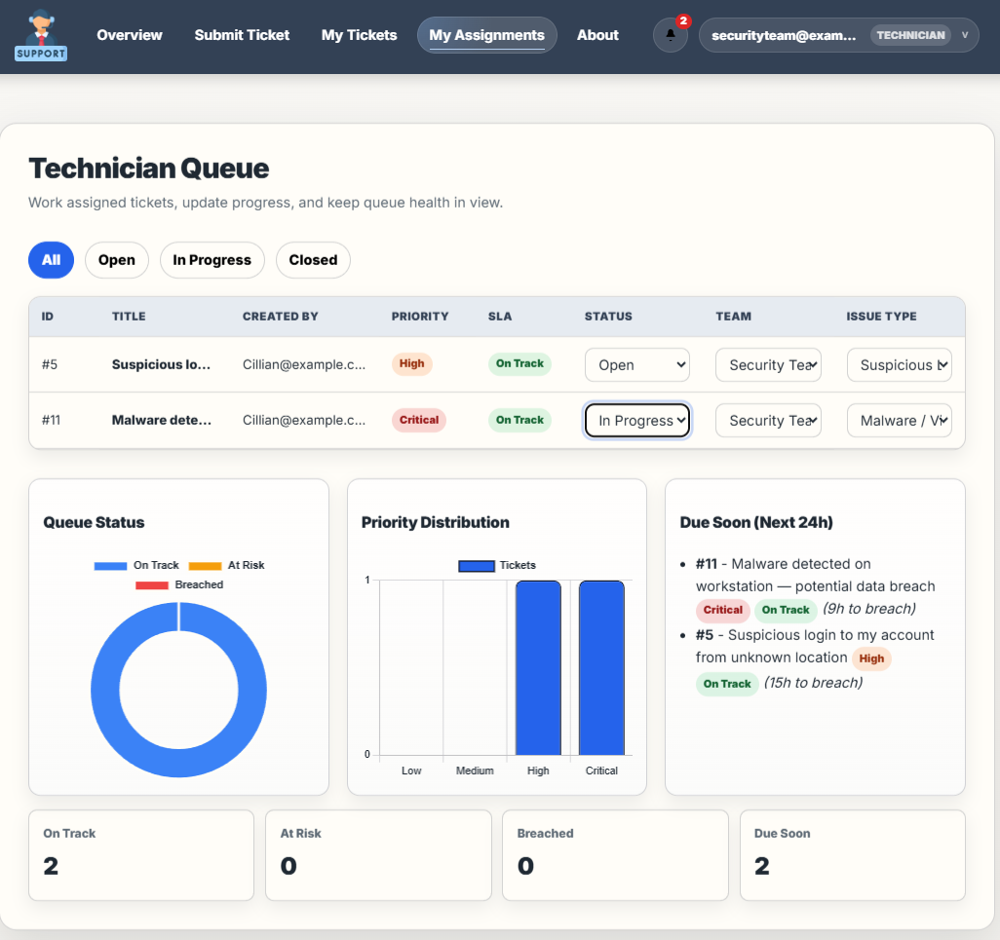
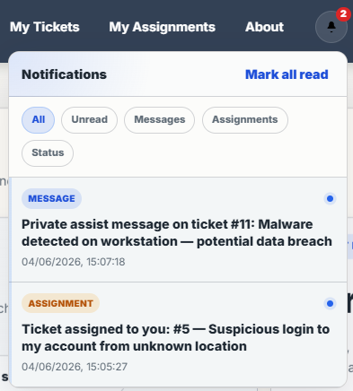
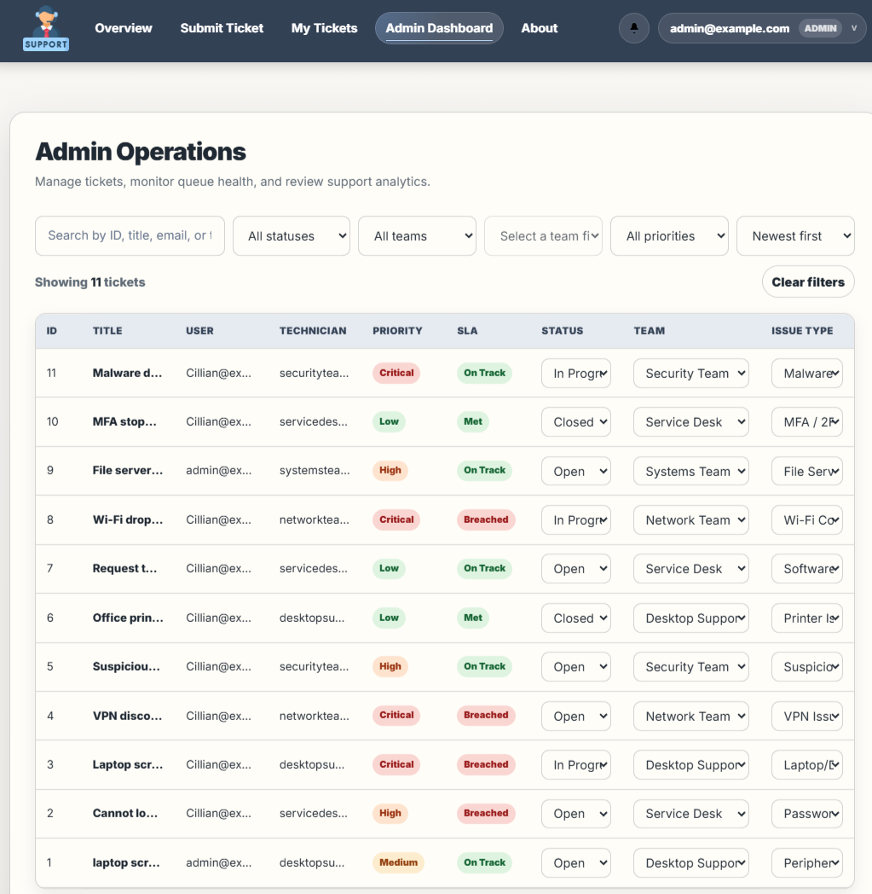
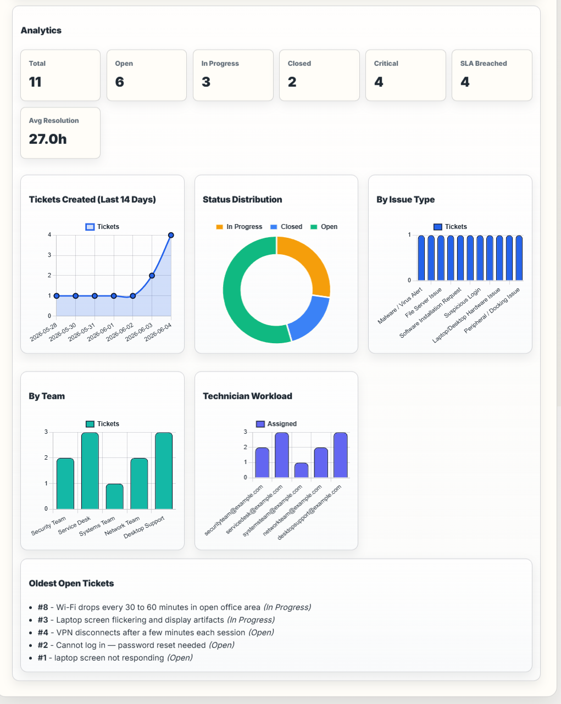
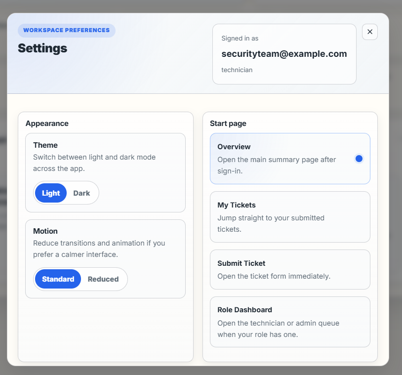

# IT Ticketing System

A full-stack IT support ticketing platform with role-based access and ML-assisted ticket classification.

## Stack

- `backend/` — FastAPI, SQLite, JWT auth, ticket logic, notifications, uploads
- `frontend/` — React + Vite
- `backend/ml/` — runtime model loading and inference
- `ml/` — training and evaluation scripts, datasets

## Features

- JWT auth with roles: `user`, `technician`, `admin`
- ML-based issue-type prediction on ticket submission
- automatic team routing, technician assignment, priority, and SLA tracking
- ticket status and category updates
- public messages and private assist messages between staff
- attachment upload/download
- notifications with unread count
- overview, technician queue, and admin dashboards

## Requirements

- Python 3.10+
- Node.js 18+

## Run Locally

**Backend** (port 8000):

```bash
cd backend
python -m venv venv
venv\Scripts\activate
pip install -r requirements.txt
uvicorn main:app
```

**Frontend** (port 5173):

```bash
cd frontend
npm install
npm run dev
```

## Demo Accounts

Seeded automatically on backend startup.

| Role | Email | Password |
|------|-------|----------|
| Admin | `admin@example.com` | `admin123` |
| Technician | `servicedesk@example.com` | `tech123` |
| Technician | `desktopsupport@example.com` | `tech123` |
| Technician | `networkteam@example.com` | `tech123` |
| Technician | `systemsteam@example.com` | `tech123` |
| Technician | `securityteam@example.com` | `tech123` |

Regular users can register from the UI.

## How It Works

On ticket submission the backend predicts an issue type from the description, maps it to a support team, sets a base priority, and assigns a technician if one exists for that team. Priority escalates with ticket age (one level at 24h, two at 48h, Critical at 72h). SLA state is derived from age versus the target window.

## Machine Learning

- Runtime: `backend/ml/ticket_classifier.pkl`, `backend/ml/ml_model.py`
- Train: `python ml/train_model.py`
- Evaluate: `python ml/testing.py`
- Datasets: `ml/data/`

## Screenshots

### Submit Ticket


### My Tickets


### Ticket Detail


### Ticket Detail — Expanded Info


### Technician Queue


### Notifications


### Admin Operations


### Analytics


### Settings

